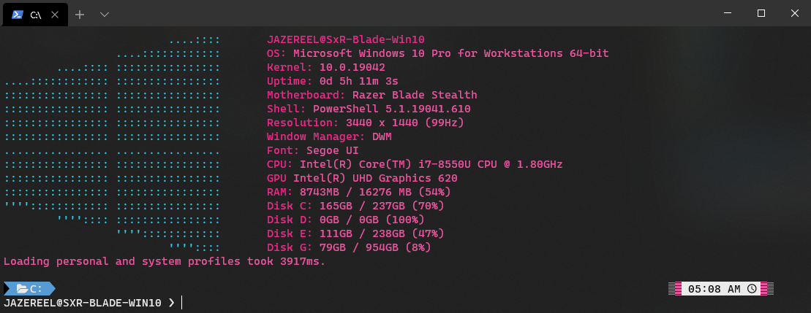
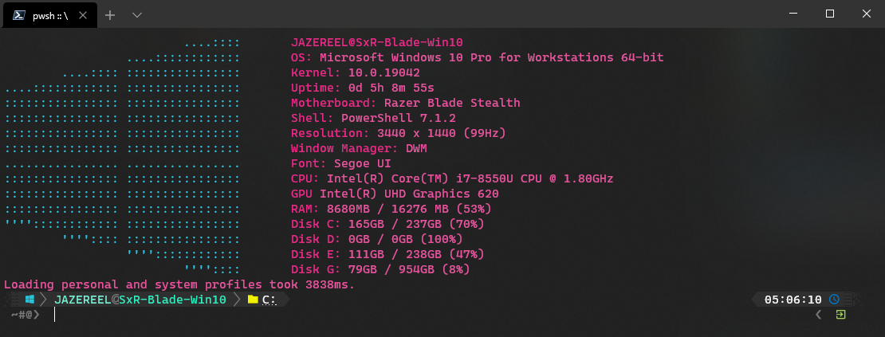
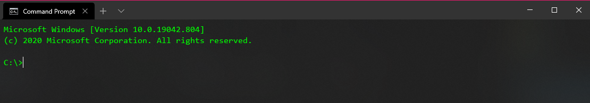

# Windows Terminal: Themes
Themes for Windows Terminal

`settings.json` file is when you click on the down arrow then settings within the Terminal application.

# PowerShell: 5
-----
<br>


While in PowerShell 5, within Terminal: `notepad $PROFILE`. This should bring up a file (create new if necessary). Within this file, input:

```
Import-Module posh-git
Import-Module oh-my-posh
Import-Module Terminal-Icons
Import-Module PSReadLine
Set-Theme Operator
Clear
```

Save the file. Return to PowerShell: 5 within Terminal and input:
```
Install-Module -Name PowerShellGet -Force
Set-ExecutionPolicy RemoteSigned
Install-Module post-git -Scope CurrentUser
Install-Module oh-my-posh -Scope CurrentUser
Install-Module Terminal-Icons -Scope CurrentUser
Install-Module PSReadLine -Scope CurrentUser
. $PROFILE
```

# PowerShell: 7
-----
<br>


While in PowerShell 7, within Terminal: `notepad $PROFILE`. This should bring up a file (create new if necessary). Within this file, input:

```
Import-Module posh-git
Import-Module oh-my-posh
Import-Module Terminal-Icons
Import-Module PSReadLine
Set-PoshPrompt -Theme slim
Clear
```

Save the file. Return to PowerShell: 7 within Terminal and input:
```
Install-Module -Name PowerShellGet -Force
Set-ExecutionPolicy RemoteSigned
Install-Module post-git -Scope CurrentUser
Install-Module oh-my-posh -AllowPrerelease -Scope CurrentUser
Install-Module Terminal-Icons -Scope CurrentUser
Install-Module PSReadLine -Scope CurrentUser
. $PROFILE
```

# Command Prompt
-----
<br>


# Fonts
-----

The fonts that you need are:
[Cascadia Code PL](https://github.com/microsoft/cascadia-code/releases) and the rest of the fonts in the `Fonts` folder. Basically, any powerline glyph nerd font.


# Sources
-----
And copyrights should belong to them, if any.

- [oh-my-posh v2](https://github.com/JanDeDobbeleer/oh-my-posh)
- [oh-my-posh v3](https://github.com/JanDeDobbeleer/oh-my-posh3)
- [posh-git](https://github.com/dahlbyk/posh-git)
- [Aurelia Theme](https://github.com/mobilemancer/windows-terminal-aurelia)
- [Windows Screenfetch](https://github.com/JulianChow94/Windows-screenFetch)
